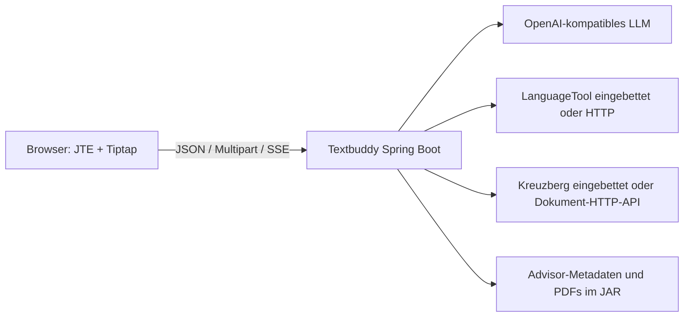

# Architektur

## Zielbild

Textbuddy ist eine einzelne Spring-Boot-Anwendung für einen zentral betriebenen Team-Server. Es gibt keine Datenbank und keinen verteilten Anwendungszustand. Diese Begrenzung ist Absicht: Deployment, Fehlersuche und Weiterentwicklung sollen ohne zusätzliche Infrastruktur verständlich bleiben.

## Aufbau

- `web`: HTTP-Verträge, Eingabegrenzen, Fehlerabbildung und Startseite.
- Fachpakete wie `quickaction`, `textcorrection`, `advisor` und `document`: kleine Services und unveränderliche Request-/Response-Typen.
- `integration`: Provider-Adapter. Alle LLM-Funktionen hängen an genau einem `TextbuddyLlmClient`.
- `config`: ein Konfigurationsaggregat (`TextbuddyProperties`) und die Auswahl der Adapter.
- `frontend`: eine TypeScript-/Tiptap-Insel; keine zweite eigenständige Webanwendung.

Neue Abstraktionen sollen nur entstehen, wenn es tatsächlich mehrere Implementierungen oder eine klar testbare Grenze gibt. Für reine Weiterleitung ist eine zusätzliche Klasse kein Gewinn.

## HTTP-Verträge

| Endpoint | Format | Zweck |
| --- | --- | --- |
| `POST /api/text-correction` | JSON | Rechtschreib- und Stilhinweise |
| `POST /api/sentence-rewrite` | JSON | Satzalternativen |
| `POST /api/word-synonym` | JSON | Synonyme im Kontext |
| `POST /api/quick-actions/{action}` | JSON | Volltext-Aktionen; eine abschliessende Antwort |
| `GET /api/advisor/docs` | JSON | Statischer Advisor-Katalog |
| `GET /api/advisor/doc/{name}` | PDF | Referenzdokument im Viewer |
| `POST /api/advisor/validate` | SSE | Regelprüfung mit fortlaufenden Treffern |
| `POST /api/convert/doc` | Multipart/JSON | Dokument in bereinigtes HTML umwandeln; das Frontend reduziert es auf Plaintext |

Nur die Advisor-Prüfung verwendet SSE, weil dort mehrere fachlich unabhängige Treffer laufend sichtbar werden. Quick Actions liefern eine normale JSON-Antwort; der LLM-Provider liefert intern ebenfalls nur eine vollständige Antwort.

## Zustand und Daten

- Advisor-Metadaten und PDFs werden beim Start einmal aus dem Klassenpfad geladen. Alle angemeldeten Benutzer sehen denselben Katalog.
- Das persönliche Wörterbuch liegt ausschliesslich in `localStorage` des Browsers. Es gibt keine Synchronisierung oder Serversicherung.
- Bearbeitete Texte und hochgeladene Dokumente werden nicht dauerhaft gespeichert.
- Provider- und Netzwerkadapter führen keine automatischen Wiederholungen aus. Einzige Ausnahme ist der lokale OCR-Adapter: Scheitert eine explizit gewählte Nicht-Standardsprache an einem OCR-Fehler, versucht er die Erkennung einmal mit der Standardsprache.

## Sicherheitsgrenzen

Im Produktionsmodus sind nur Login, Fehlerseite und statische Assets öffentlich; alle übrigen Routen verlangen eine OIDC-Anmeldung. Zustandsändernde Browseranfragen tragen ein CSRF-Token. Ein ungeschützter Start ist nur bei expliziter Loopback-Bindung möglich. Upload-, Text- und Promptgrössen werden vor teurer Verarbeitung geprüft. CSP und `X-Frame-Options: SAMEORIGIN` erlauben eigene PDF-Ressourcen, aber keine fremde Einbettung.

Externe Provider sind eine eigene Datenschutzgrenze: LLM-Texte beziehungsweise Dokumente im HTTP-Modus verlassen den Textbuddy-Prozess. Die Entscheidung dafür und die Aufbewahrungsregeln des Providers gehören zur Betriebskonfiguration.
